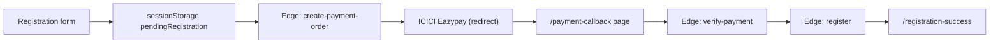
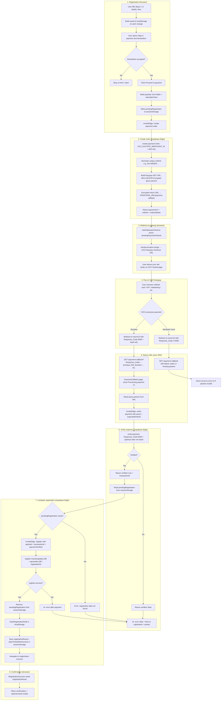

# 2AI Conference — React + Supabase

Static **React (Vite)** frontend and **Supabase** (Postgres + Edge Functions). Configure and deploy using **`SUPABASE.md`**.

### Payment flow (high level)



### Local dev

```bash
cp .env.example .env   # add VITE_SUPABASE_URL and VITE_SUPABASE_ANON_KEY
npm install
npm run dev
```
